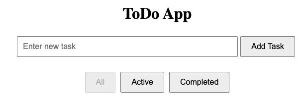

# ToDo App

[](https://ponev86.github.io/todo-app)
[](LICENSE)

ToDo App — это простое и удобное приложение для управления списком дел. Построено с использованием TypeScript, React и React Hooks.



## Функциональные возможности

- **Добавление задач:** Позволяет добавлять новые задачи в список дел.
- **Фильтрация задач:** Просмотр всех задач, только выполненных или только невыполненных.
- **Переключение состояния задач:** Возможность пометить задачи как выполненные или невыполненные.
- **Удаление задач:** Удаление задач из списка.

## Установка

1. Клонируйте репозиторий:

   ```bash
   git clone https://github.com/ponev86/todo-app.git
   cd todo-app
   ```

2. Установите зависимости:

   ```bash
   npm install
   ```

3. Запустите приложение:

   ```bash
   npm start
   ```

Приложение будет доступно по адресу `http://localhost:3000`.
